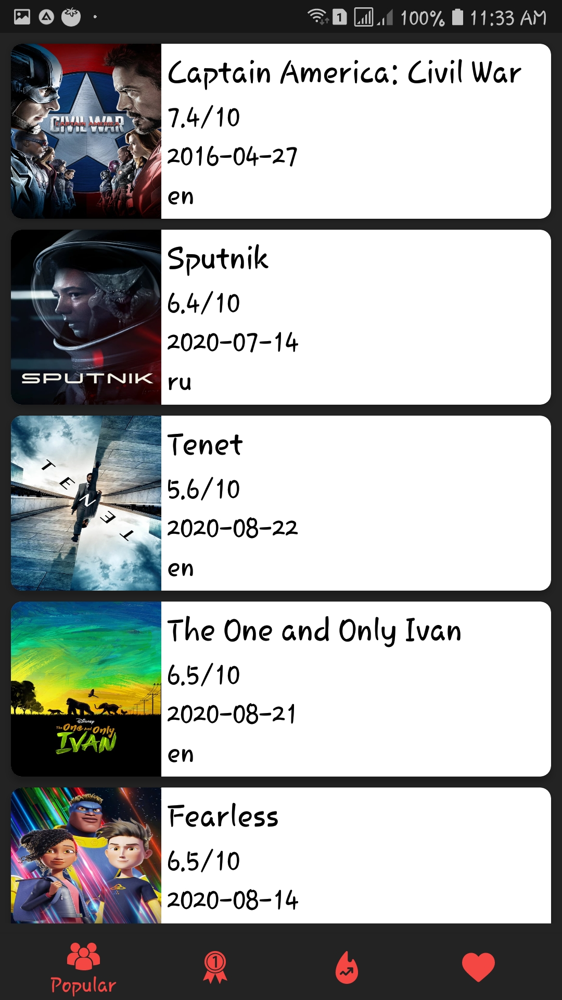
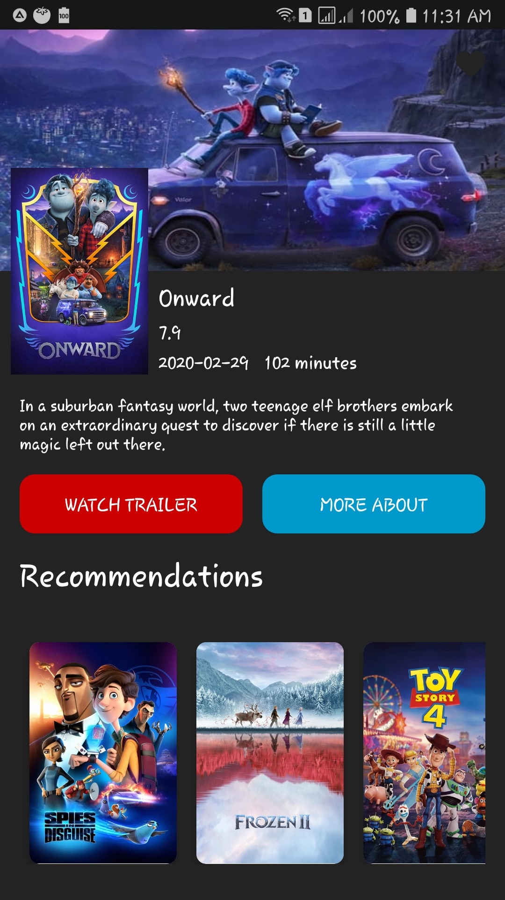
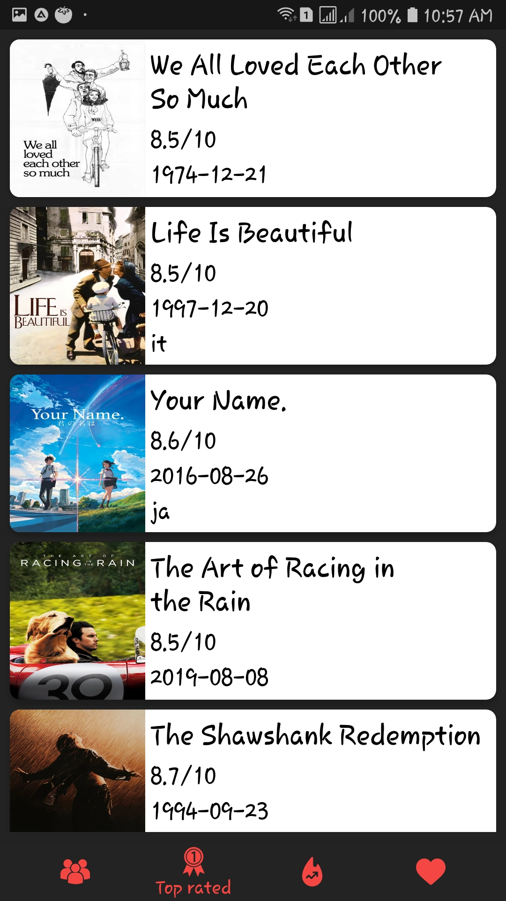
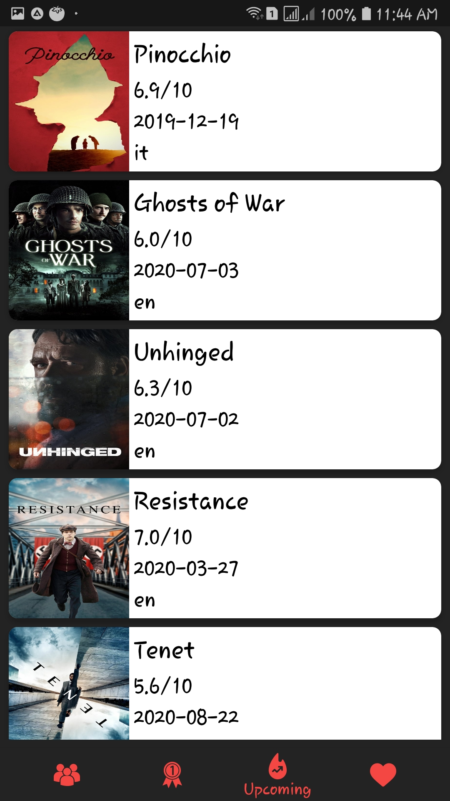

# MoviesNews
This repository is for my new app called MoviesNews which give the user updated news about movies including popular movies, upcoming movies, and top rated movies.

# API
I used The Movie Database (TMDB) APIs

# Built with:

Kotlin
---
MVVM and Repository pattern
---
Hilt
---
Coroutines
---
Room
---
LiveData
---
ViewModel
---
JetpackNavigation
---
Retrofit
---
Gson
---
Picasso
---

# Screen shots: 
---

 

 

 

 

 

 

